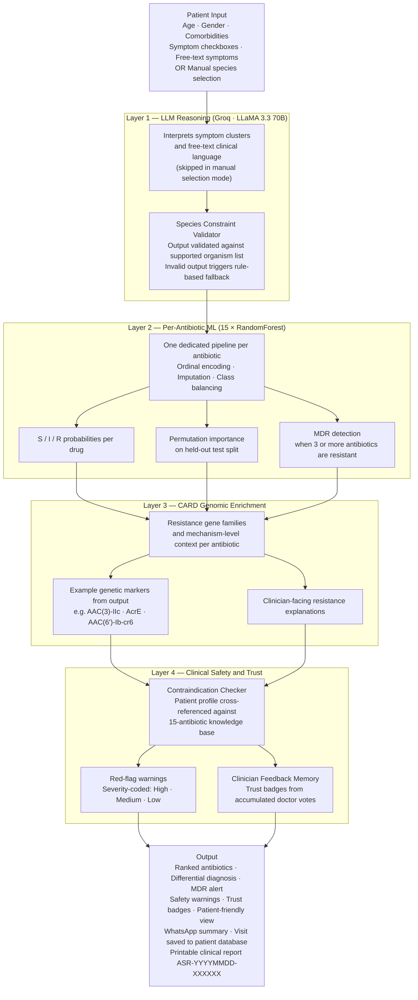

<div align="center"> <pre>
█████╗ ███╗   ██╗████████╗██╗██████╗ ██╗ ██████╗     ███████╗███████╗███╗   ██╗███████╗███████╗
██╔══██╗████╗  ██║╚══██╔══╝██║██╔══██╗██║██╔═══██╗    ██╔════╝██╔════╝████╗  ██║██╔════╝██╔════╝
███████║██╔██╗ ██║   ██║   ██║██████╔╝██║██║   ██║    ███████╗█████╗  ██╔██╗ ██║███████╗█████╗
██╔══██║██║╚██╗██║   ██║   ██║██╔══██╗██║██║   ██║    ╚════██║██╔══╝  ██║╚██╗██║╚════██║██╔══╝
██║  ██║██║ ╚████║   ██║   ██║██████╔╝██║╚██████╔╝    ███████║███████╗██║ ╚████║███████║███████╗
╚═╝  ╚═╝╚═╝  ╚═══╝   ╚═╝   ╚═╝╚═════╝ ╚═╝ ╚═════╝     ╚══════╝╚══════╝╚═╝  ╚═══╝╚══════╝╚══════╝
</pre> </div> <p align="center"><i>From symptom cluster to ranked therapy recommendation, in one workflow.</i></p> <p align="center">        </p> <p align="center"> <b>9,947 patient records &nbsp;·&nbsp; 15 antibiotic models &nbsp;·&nbsp; 9 bacterial species &nbsp;·&nbsp; ~74% accuracy</b> </p>

---

The first antibiotic choice is made before culture results arrive. That window, where a clinician is working from symptoms and instinct alone, is where bad empiric therapy happens. It is also where most clinical AI tools stop being useful.

**AntibioSense was built specifically for that window.**

Feed it a patient profile and a symptom picture — or select a species directly if you already have one in mind. The server-side pipeline identifies the most likely pathogen, ranks the antibiotics that will work against it, explains the resistance mechanisms behind every recommendation, flags multidrug resistance if the pattern warrants it, and hands the clinician a printable clinical report. The browser is the interface; the reasoning runs on Flask, Groq, and a 15-model scikit-learn ensemble on the backend.

It is a hackathon prototype. It is also a complete symptom-to-therapy reasoning pipeline with two entry modes, a genomic enrichment layer, and a printable clinical report.

---

## The Problem with Every Other Tool

Most antibiotic prediction demos share the same flaw: **they start from a known organism**.

You give them _E. coli_ and they tell you which drugs work. That is the easy part. The hard clinical question is: _given these symptoms and this patient history, what organism are we likely dealing with?_ That reasoning step, the triage layer that connects presentation to pathogen, is what separates a useful tool from a demo that requires a microbiologist to operate.

AntibioSense adds that layer. It was not bolted on. It is the first thing that runs — and for clinicians who already have a suspected organism, manual species selection lets them skip straight to drug ranking without the LLM step.

---

## The Symptom Prediction Layer

When a clinician enters a patient profile and selects symptoms, the app does not immediately start scoring antibiotics. It first asks: _what is this?_

A Groq-hosted LLaMA 3.3 70B model receives the full clinical picture, including any free-text symptom description written in plain language, and produces a constrained species hypothesis before any drug ranking begins. The word _constrained_ matters here. The model is given the exact supported organism list in its system prompt. Its output is validated against that list. Near-match fuzzy logic handles minor naming variations. If the response is invalid for any reason, a deterministic rule-based fallback takes over silently.

The result is a differential diagnosis, not just a top pick. Each candidate species comes with a confidence score, the symptom features that support it, and documented caveats. That clinical reasoning chain is surfaced in the UI and preserved in the printed report.

This is what makes the symptom-based mode feel like a triage assistant rather than a form with a submit button. Clinicians who prefer to bypass this step can select a species manually and go directly to the susceptibility layer.

---

## The Full Pipeline



Each layer is independently useful. Together they produce a clinical reasoning chain that no single model can replicate.

---

## What Makes This Different

|Instead of this|AntibioSense does this|
|---|---|
|Requires a known organism to start|Infers the organism from symptoms, or accepts manual species selection as a first-class mode|
|Single susceptibility score|Ranked probabilities across 15 antibiotics with S/I/R breakdown|
|Prediction with no explanation|CARD resistance genes and mechanisms attached to every recommendation|
|One pooled model|One dedicated pipeline per antibiotic|
|Gini impurity for explainability|Permutation importance on held-out test data|
|Free-form LLM that can hallucinate organisms|Species output constrained and validated against the lab panel|
|Surfaces only the top recommendation|Flags multidrug resistance when the pattern warrants it|
|Breaks without LLM access|Multi-key Groq fallback plus deterministic rule-based fallback|
|No safety warnings|Contraindication checker with 15-antibiotic knowledge base sourced from WHO, FDA, BNF, IDSA|
|Static predictions that never improve|Doctor feedback memory system — clinician trust badges from accumulated votes|
|Results vanish after closing the browser|SQLite patient database with visit timeline and meaningful date-based PIDs|
|Clinical jargon only|Patient-friendly view toggle — plain-language explanations for patients and families|
|No way to share results quickly|WhatsApp-ready summary with one-click copy-to-clipboard|

---

## Feature Set

**Clinical intelligence**

Symptom-to-species prediction from both structured checkboxes and free-text clinical descriptions. Manual species selection as a first-class entry point for clinicians who already have a suspected organism. Top 3 antibiotics ranked by susceptibility probability with full S/I/R breakdown and model accuracy annotation. Confidence-scored differential diagnosis with supporting features and documented caveats. MDR detection and alerting. Permutation-based feature importance showing exactly which clinical variables drove the prediction. CARD genomic insight cards with gene family, resistance mechanism, and example genetic markers from the enrichment output. Resistance heatmap across the full antibiotic panel.

**Patient safety**

Red-flag warnings and contraindication alerts powered by a deterministic knowledge base (`contraindications.json`) covering all 15 antibiotics. Each rule is sourced from clinical guidelines (WHO, FDA, BNF, IDSA, ICMR). Warnings are severity-coded — 🔴 High (contraindication), 🟡 Medium (caution), 🟢 Low (note) — and rendered directly on antibiotic cards. The full 15-antibiotic table shows triage indicator dots (⚠) so the doctor can spot risks at a glance.

**Patient history and database**

SQLite-backed patient database (`patient_db.py`) provides server-side persistence that survives browser reloads and works across devices. Patients are assigned meaningful IDs in `DDMMYY-NNN` format (e.g., `030426-001` = first patient registered on 3 Apr 2026). Every prediction auto-saves as a visit entry under the active patient, building a clickable visit timeline. Returning patients are found by PID or name search, and their demographics auto-fill the form.

**Doctor feedback memory**

After each prediction, the top 3 antibiotic cards show 👍 (Yes, it worked) and 👎 (No, it failed) buttons. Feedback is aggregated per species–antibiotic pair in `feedback.json` and used to compute clinician trust ratios. When enough doctors have voted (≥3), trust badges appear: 🟢 Clinician-validated (≥75%), 🟡 Mixed feedback (45–74%), 🔴 Clinician-flagged (<45%). The system learns from every doctor who uses it.

**Explain to patient**

A pill-style toggle on the results page flips between Clinical View (default) and Patient View. Patient view replaces all jargon with plain-language explanations: scientific species names become short descriptions, susceptibility percentages become effectiveness statements, MDR alerts become reassuring but clear warnings, and a "What Does This Mean?" card provides actionable advice. This lets doctors show the screen to patients and families without needing to translate.

**WhatsApp-ready summary**

A one-click copy-to-clipboard section at the bottom of results generates a formatted clinical note: patient profile (with PID if loaded), suspected pathogen with confidence, top 3 antibiotics, MDR status, and key warnings. The doctor previews the text before copying. No server round-trip — it is 100% frontend JavaScript.

**User experience**

Free-text "Other Symptoms" field that auto-grows as the user types and passes the input directly to the LLM. Groq inference badge during loading that shows the Groq provider and primary model label. Skeleton loading that mirrors the actual result structure so the layout is understood before the data arrives. Browser-native clinical report generation via `window.print()` with no libraries and no server round-trip. Advanced Filters tucked behind a collapsible panel. Dark claymorphism design with recessed inputs and raised clay-shadow cards. Inline new-patient registration panel (no browser popups).

---

## Dataset and Model Performance

|Property|Value|
|---|---|
|Dataset|9,947 clinical patient records|
|Bacterial species|9|
|Antibiotic targets|15|
|Model family|`RandomForestClassifier`, one pipeline per antibiotic|
|Preprocessing|Ordinal encoding, median imputation, infection-frequency ordering, species normalization, class balancing|
|Explainability|Permutation importance on held-out test split|
|Accuracy range|58.9% to 71.5% across 15 models|
|Macro-F1 range|39.6% to 47.8% across 15 models|

Accuracy alone flatters on imbalanced data. In a resistance dataset, resistant and intermediate cases are the clinically important minority. Macro-F1 weights all three classes equally and gives a more honest picture of where the model performs and where it does not.

The 15 independent models are framed as a decision-support ensemble. The system is designed to surface uncertainty, not smooth it over.

---

## Groq and Why Latency Is a Clinical Concern

Groq runs on custom LPU hardware designed to keep LLM inference low-latency and interactive. At the 70B parameter scale, inference latency is a real concern — a multi-second loading state between symptom entry and recommendation is a tool that clinicians stop trusting. Groq is used specifically to keep the LLM layer from becoming the bottleneck in the pipeline.

In practice, the full pipeline — LLM species inference, 15-model susceptibility scoring, and CARD enrichment — completes in a few seconds end-to-end in the current demo environment. The LLM step is a small fraction of that.

**Fallback chain:**

```python
# Key priority order
GROQ_API_KEY_1 -> GROQ_API_KEY_2 -> GROQ_API_KEYS list

# Model fallback chain
llama-3.3-70b-versatile -> [GROQ_MODEL_FALLBACKS]

# If every LLM path fails
-> Deterministic rule-based species predictor
-> Raw CARD data without LLM enrichment
-> App remains fully functional
```

---

## Quick Start

**Prerequisites:** Python 3.10+, pip, a modern browser. Groq API key is optional but recommended.

```bash
# Clone and enter
git clone <your-repo-url>
cd antibiosense_final

# Virtual environment
python3 -m venv venv && source venv/bin/activate   # macOS / Linux
python -m venv venv && .\venv\Scripts\Activate.ps1  # Windows PowerShell

# Install
pip install -r requirements.txt

# Groq key (optional)
echo "GROQ_API_KEY=your_key_here" > .env

# Run
python app.py
```

Open `http://127.0.0.1:5000`. Trained model artifacts are bundled in `models/` so the app runs immediately without retraining.

**To retrain:**

```bash
python train_model.py --data Bacteria_dataset_Multiresictance.csv
```

**Environment variables:**

|Variable|Purpose|
|---|---|
|`GROQ_API_KEY`|Primary key|
|`GROQ_API_KEY_1`, `GROQ_API_KEY_2`|Fallback keys in priority order|
|`GROQ_API_KEYS`|Comma-separated fallback list|
|`GROQ_MODEL`|Override default model|
|`GROQ_MODEL_FALLBACKS`|Comma-separated fallback model chain|
|`DB_PATH`|SQLite database path (default: `./antibiosense.db`, set to `/var/data/antibiosense.db` for Render deployment)|

---

## Project Structure

```
antibiosense_final/
│
├── app.py                          ← Flask routes, prediction logic, CARD enrichment,
│                                     contraindication evaluation, feedback API, patient APIs
├── patient_db.py                   ← SQLite database: patients, visits, PID generation (DDMMYY-NNN)
├── artifact_loader.py              ← Shared loader for split model artifacts
├── train_model.py                  ← Training pipeline
├── requirements.txt
│
├── models/
│   ├── meta.json                   ← Per-model accuracy, feature metadata, and split model manifest
│   ├── model_*.pkl                 ← One serialized RandomForest pipeline per antibiotic
│   ├── card_ontology.json          ← CARD resistance gene database
│   └── contraindications.json      ← Red-flag warning rules for all 15 antibiotics
│
├── feedback.json                   ← Doctor feedback memory (auto-populated as doctors vote)
├── antibiosense.db                 ← SQLite patient database (auto-created at first run)
│
├── templates/
│   └── index.html                  ← Single-page frontend (all views, all features)
│
├── static/
├── .env                            ← Gitignored (Groq API keys)
└── .gitignore
```

---

## Deployment on Render

AntibioSense is deployment-ready. The database path is configurable via the `DB_PATH` environment variable.

```
1. Push code to GitHub
2. Create a Web Service on render.com
3. Build Command:   pip install -r requirements.txt
4. Start Command:   gunicorn app:app
5. Add a Persistent Disk (1 GB, mount path: /var/data)
6. Set Environment Variables:
     GROQ_API_KEY = your_key_here
     DB_PATH      = /var/data/antibiosense.db
7. Deploy — patient records and feedback persist across restarts
```

---

## Demo Flow

```
Open  http://127.0.0.1:5000

── Patient Registration ───────────────────────────────────────

  [ + New Patient ]  →  Enter name (optional)  →  PID: 030426-001
  Or search:  [ 030426 ]  →  Select from results  →  form auto-fills

── Mode A: Symptom-based ──────────────────────────────────────

Patient context
  Age 52  |  Female  |  Diabetes: Yes  |  Prior hospitalisation: Yes

Symptoms
  Burning urination
  Cloudy/bloody urine
  Pelvic pain

Free-text
  "Symptoms worsening over 3 days, low-grade fever at night"

── Mode B: Manual species selection ───────────────────────────

Select species directly from the dropdown
Skips the LLM step, goes straight to susceptibility scoring

── Both modes converge here ───────────────────────────────────

Click  [ Analyse and Recommend Antibiotics ]

  Groq badge: Running on Groq  llama-3.3-70b-versatile
  Skeleton loading mirrors the result layout
  Results in a few seconds end-to-end in the current demo environment

Output
  Identified pathogen with confidence score
  Differential diagnosis with supporting features and caveats
  Top 3 antibiotics with S/I/R breakdown
  🔴 Red-flag warnings on contraindicated drugs
  ✅ Clinician trust badges from feedback memory
  CARD resistance mechanisms and example genetic markers
  MDR alert if the pattern warrants it
  Feature importance
  Resistance heatmap

── Post-Prediction ────────────────────────────────────────────

  Toggle  [ Patient View ]  →  Plain-language results for patients
  Doctor feedback  →  [ 👍 Yes, it worked ]  [ 👎 No, it failed ]
  📋 WhatsApp Summary  →  Copy formatted note with one click
  💾 Visit auto-saved to patient timeline
  Ctrl+P or  [ Generate Report ]  →  Clinical PDF  ASR-YYYYMMDD-XXXXXX
```

---

## What Is and Is Not in This Build

**Working:**

- Symptom-based species prediction via Groq LLM
- Manual species selection as a first-class entry mode
- 15 per-antibiotic susceptibility models
- CARD resistance gene enrichment
- MDR detection and alerting
- Permutation feature importance
- Resistance heatmap
- Free-text Other Symptoms passed directly to LLM
- Groq inference badge during loading
- Skeleton loading
- Browser-native clinical PDF report generation
- Multi-key Groq fallback and rule-based species fallback
- Red-flag warnings and contraindication alerts (15-antibiotic knowledge base)
- Patient history database with meaningful PID generation (DDMMYY-NNN)
- Visit timeline with auto-save and search
- Doctor feedback memory system with clinician trust badges
- Explain to Patient toggle (Clinical View ↔ Patient View)
- WhatsApp-ready clinical summary with one-click copy
- Render deployment-ready with Persistent Disk support

**Not in scope yet:**

- EHR and EMR integration
- Real-time local antibiogram data feed
- Culture result confirmation loop
- Voice input for symptoms (Web Speech API)
- Expanded organism panel beyond the current 9 species

---

## Acknowledgements

[Groq](https://groq.com/) for LPU-powered inference at scale. [CARD](https://card.mcmaster.ca/) for the resistance gene and mechanism database. [Meta AI](https://ai.meta.com/) for LLaMA 3.3 70B. The scikit-learn, Flask, pandas, and NumPy ecosystem for making this buildable in a weekend.

---

<p align="center"> Built for CureAI Hackathon <br/><br/> <i>The goal was never just to predict.<br/> It was to make resistance visible, explainable, and actionable, in one workflow.</i> <br/><br/> <code>symptoms</code> &nbsp;›&nbsp; <code>species</code> &nbsp;›&nbsp; <code>antibiotics</code> &nbsp;›&nbsp; <code>safety checks</code> &nbsp;›&nbsp; <code>feedback</code> &nbsp;›&nbsp; <code>report</code> </p>